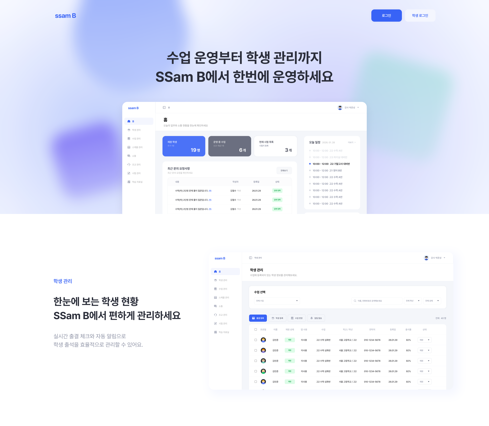

<div align="center">


# SSam B 프론트엔드

**학원/수업 운영을 위한 통합 플랫폼**

강사/조교(MGMT)와 학생/학부모(SVC)를 위한 직관적인 대시보드와 관리 시스템

[](https://nextjs.org/)
[](https://www.typescriptlang.org/)
[](https://reactjs.org/)
[](https://tailwindcss.com/)



</div>

---

## 📋 목차

- [주요 기능](#-주요-기능)
- [기술 스택](#-기술-스택)
- [빠른 시작](#-빠른-시작)
- [프로젝트 구조](#-프로젝트-구조)
- [권한 및 인증](#-권한-및-인증)
- [사용 가능한 스크립트](#-사용-가능한-스크립트)
- [배포 및 운영](#-배포-및-운영)

---

## ✨ 주요 기능

### 🏠 랜딩 페이지

- 메인 랜딩: `/`

### 🔐 인증 시스템

**강사/조교 (Educators)**

- 로그인: `/educators/login`
- 강사 회원가입: `/educators/instructor-register`
- 조교 회원가입: `/educators/assistant-register`

**학생/학부모 (Learners)**

- 로그인: `/learners/login`
- 회원가입: `/learners/register`

### 👨‍🏫 강사/조교 대시보드 (`/educators/*`)

| 기능           | 라우트                     | 설명                     |
| -------------- | -------------------------- | ------------------------ |
| 🧩 홈          | `/educators`               | 메인 대시보드            |
| 👤 프로필      | `/educators/profile`       | 개인 정보 관리           |
| 👥 학생 관리   | `/educators/students`      | 수강생 정보 및 출결 관리 |
| 📚 수업 관리   | `/educators/lectures`      | 강의 생성, 수정, 조회    |
| 📅 일정 관리   | `/educators/schedules`     | 수업 일정 및 캘린더      |
| 💬 소통        | `/educators/communication` | 공지사항 작성, 문의 답변 |
| 🤝 조교 관리   | `/educators/assistants`    | 조교 권한 및 업무 관리   |
| 📝 시험/리포트 | `/educators/exams`         | 평가 및 성적 관리        |
| 📂 자료실      | `/educators/materials`     | 학습 자료 업로드 및 공유 |

### 🎓 학생/학부모 대시보드 (`/learners/*`)

| 기능             | 라우트                    | 설명                        |
| ---------------- | ------------------------- | --------------------------- |
| 🧩 메인 대시보드 | `/learners`               | 메인 대시보드               |
| 👤 프로필        | `/learners/profile`       | 개인 정보 관리              |
| 📖 나의 강의     | `/learners/lectures`      | 수강 중인 강의 및 상세 정보 |
| 💬 소통          | `/learners/communication` | 공지사항 확인, 문의글 작성  |

### ⏳ 기타

- 조교 승인 대기: `/pending-approval`

---

## 🛠 기술 스택

### Core

- **Framework:** Next.js `16.1.6` (App Router, RSC)
- **Language:** TypeScript `^5`
- **Runtime:** Node.js `24.13.0`
- **Package Manager:** pnpm `10.28.0`

### UI/UX

- **Library:** React `19.2.4`
- **Styling:** Tailwind CSS `4`
- **Component Library:** shadcn/ui + Radix UI
- **Charts:** Recharts
- **Calendar:** react-big-calendar, react-day-picker
- **Editor:** TipTap
- **PDF:** @react-pdf/renderer

### State & Data Management

- **Server State:** TanStack Query (React Query)
- **Client State:** Zustand
- **HTTP Client:** Axios
- **Form Management:** React Hook Form
- **Validation:** Zod

### Quality & Monitoring

- **Observability:** Sentry (server/edge/client)
- **Testing:** Jest
- **Linting:** ESLint
- **Formatting:** Prettier

---

## 🚀 빠른 시작

### 📦 요구사항

프로젝트 실행을 위해 다음 버전이 필요합니다:

| 도구    | 버전      | 설정 파일                        |
| ------- | --------- | -------------------------------- |
| Node.js | `24.13.0` | `.nvmrc`, `package.json#engines` |
| pnpm    | `10.28.0` | `package.json#packageManager`    |

### 💻 설치 및 실행

```bash
# 1. 의존성 설치
pnpm install

# 2. 환경 변수 설정
cp .env.example .env.local

# 3. Git hooks 설정
pnpm run prepare

# 4. 개발 서버 실행
pnpm dev
```

개발 서버가 실행되면 [http://localhost:3000](http://localhost:3000)에서 확인할 수 있습니다.

### 🔧 환경 변수 설정

`.env.local` 파일에 다음 환경 변수를 설정해주세요:

```bash
# API 엔드포인트
NEXT_PUBLIC_API_BASE_URL=         # 강사/조교용 API
NEXT_PUBLIC_API_BASE_URL_SVC=     # 학생/학부모용 API

# Sentry (선택사항)
NEXT_PUBLIC_SENTRY_DSN=
SENTRY_AUTH_TOKEN=
```

---

## 📁 프로젝트 구조

```
src/
├── app/                    # Next.js App Router
│   ├── (auth)/            # 인증 관련 라우트
│   ├── educators/         # 강사/조교 라우트
│   ├── learners/          # 학생/학부모 라우트
│   └── _components/       # 페이지별 컴포넌트
├── components/            # 공용 컴포넌트
│   └── ui/               # shadcn/ui 컴포넌트
├── services/             # API 클라이언트 및 도메인 로직
├── providers/            # React Context Providers
├── stores/               # Zustand 상태 관리
├── hooks/                # 커스텀 훅
├── types/                # TypeScript 타입 정의
├── validation/           # Zod 스키마
├── utils/                # 유틸리티 함수
└── constants/            # 상수 정의
```

### 주요 디렉토리 설명

| 디렉토리         | 역할                                             |
| ---------------- | ------------------------------------------------ |
| `src/app`        | 라우팅, 페이지, 레이아웃, 메타데이터, 에러 처리  |
| `src/components` | 재사용 가능한 UI 컴포넌트                        |
| `src/services`   | Axios 클라이언트 + 도메인별 API 호출 + Mapper    |
| `src/providers`  | React Query, Auth, Modal, Breadcrumb 등 Provider |
| `src/stores`     | Zustand 기반 클라이언트 상태 관리                |
| `src/hooks`      | 재사용 가능한 커스텀 훅                          |
| `src/types`      | 공통 타입 정의                                   |
| `src/validation` | Zod 스키마 및 폼 검증                            |

---

## 🔒 권한 및 인증

### 역할 기반 라우팅

SSam B는 URL 기반으로 사용자 역할을 구분합니다:

| URL 패턴       | 역할   | 설명                                |
| -------------- | ------ | ----------------------------------- |
| `/educators/*` | `MGMT` | 강사(INSTRUCTOR) 및 조교(ASSISTANT) |
| `/learners/*`  | `SVC`  | 학생(STUDENT) 및 학부모(PARENT)     |

### 인증 방식

- **세션 관리:** 쿠키 기반 세션
- **API 통신:** 역할별 다른 Base URL 사용
  - 강사/조교: `NEXT_PUBLIC_API_BASE_URL`
  - 학생/학부모: `NEXT_PUBLIC_API_BASE_URL_SVC`

### 조교 승인 프로세스

조교(ASSISTANT)는 가입 후 다음 조건을 만족해야 대시보드에 접근할 수 있습니다:

- `signStatus`가 `SIGNED` 상태여야 함
- 조건 미충족 시 `/pending-approval` 페이지로 자동 리다이렉트

---

## 📜 사용 가능한 스크립트

### 개발 및 빌드

```bash
pnpm dev          # 개발 서버 실행 (http://localhost:3000)
pnpm build        # 프로덕션 빌드
pnpm start        # 프로덕션 서버 실행
```

### 코드 품질

```bash
# Linting
pnpm lint         # ESLint 실행
pnpm lint:fix     # ESLint 자동 수정

# Formatting
pnpm format       # Prettier 포맷팅 적용
pnpm format:check # Prettier 체크만 수행

# Type Checking
pnpm type-check   # TypeScript 타입 체크
```

### 테스트

```bash
pnpm test         # Jest 테스트 실행
```

## 🚢 배포 및 운영

### 배포 플랫폼

이 프로젝트는 **Vercel** 배포를 전제로 구성되어 있습니다.

### Sentry 설정

에러 모니터링을 위해 Sentry가 통합되어 있습니다:

- **설정 파일:** `next.config.ts`에서 `withSentryConfig` 사용
- **클라이언트 초기화:** `src/instrumentation-client.ts`
- **Tunnel Route:** `/monitoring` (광고 차단 우회)

### 환경 변수 (배포 시)

Vercel 대시보드에서 다음 환경 변수를 설정해주세요:

```bash
NEXT_PUBLIC_API_BASE_URL
NEXT_PUBLIC_API_BASE_URL_SVC
NEXT_PUBLIC_SENTRY_DSN
SENTRY_AUTH_TOKEN
SENTRY_ORG
SENTRY_PROJECT
```

---

<div align="center">

**Made with ❤️ by SSam B Team**

</div>
